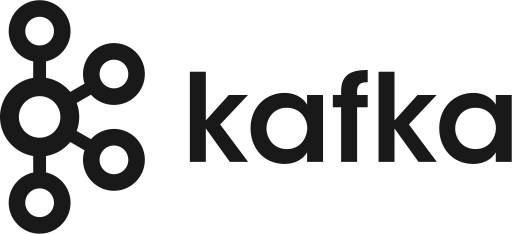

 
    
    <h1 align="center">
    <b>Welcome to my GitHub! I’m Anh Tuan (Vincent) Nguyen 👋</b>
    </h1>

&nbsp;
&nbsp;

<h3>I’m a Data Engineer with ethusiasm in Data and Business 🔎👀</h3>

- 🌱 I graduated from the University of Canberra with a bachelor's in Software Engineering
- 📔 I'm currently improving my knowledge in Data Platform Architecture and Data Engineering Operations
- 🔭 I'm looking to connect with people who share the same interests in technology, business, and books

<h3>Tech stacks 💻</h3>

